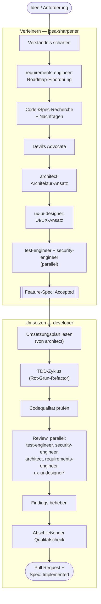

# PhotoSort

Sortiert, kategorisiert und kuratiert Urlaubsfotos, die auf einer [OpenCloud](https://opencloud.eu)-Instanz liegen. Fotos werden projektbasiert organisiert (z.B. "Costa Rica"), können manuell bewertet werden (Favorit / Album-würdig / Verwerfen) oder per Hybrid-KI (lokale Heuristiken + optionale Cloud-Bewertung) automatisch für ein Album vorgeschlagen werden. Ausgewählte Fotos werden zurück nach OpenCloud exportiert.

Web-App, installierbar als PWA, gehostet per Docker Compose auf einem Homeserver.

## Wie dieses Projekt entwickelt wird

PhotoSort wird vollständig von KI (Claude Code) entwickelt. Die Rolle des Menschen ist die des Stakeholders: Anforderungen, Ideen und Bugs werden im Dialog oder über GitHub Issues beschrieben; die KI klärt Unklarheiten per Rückfrage, arbeitet testgetrieben und dokumentiert Entscheidungen. Der vollständige Workflow ist in [`CLAUDE.md`](./CLAUDE.md) beschrieben, die fachlichen und technischen Spezifikationen liegen unter [`specs/`](./specs/README.md).

### Die Agenten

Statt eines einzelnen KI-Entwicklers arbeitet ein Team spezialisierter Claude-Agenten (definiert unter [`.claude/agents/`](./.claude/agents/)), die jeweils ein festes Aufgabengebiet und ein zugehöriges, lebendes Konzept-Dokument unter [`specs/`](./specs/README.md) besitzen:

| Agent | Verantwortung | Konzept-Dokument |
|---|---|---|
| `requirements-engineer` | Roadmap & Priorisierung, Anforderungen verfeinern, Review auf Anforderungstreue (kein Scope Creep) | `specs/roadmap.md` |
| `architect` | Architekturentscheidungen (ADRs), Umsetzungsplanung, Review aus drei Blickwinkeln (Pragmatiker / Senior-Entwickler / Pedant) | [`specs/architecture/0001-overview.md`](./specs/architecture/0001-overview.md), dieses README |
| `ux-ui-designer` | Design-System, UI/UX-Ansatz pro Feature, UI/UX-Review (nur bei Frontend-Änderungen) | `specs/architecture/0004-design-system.md` |
| `test-engineer` | Testkonzept, Teststrategie pro Feature, testfokussiertes Review | `specs/architecture/0002-testkonzept.md` |
| `security-engineer` | Sicherheitskonzept, Security-Einschätzung pro Feature, sicherheitsfokussiertes Review | `specs/architecture/0003-securitykonzept.md` |
| `developer` | Setzt eine akzeptierte Feature-Spec testgetrieben um (TDD-Zyklus, Branch, Pull Request) | — |

Der `idea-sharpener`-Skill begleitet eine rohe Idee bis zur akzeptierten Feature-Spec und zieht dabei die vier Fachspezialisten der Reihe nach hinzu. Der `developer`-Agent setzt eine akzeptierte Spec um und lässt sie am Ende von allen zutreffenden Spezialisten parallel reviewen:



<sub>\* `ux-ui-designer` reviewt nur Feature-Branches mit Frontend-/UI-Änderungen.</sub>

## Quick Start (Entwicklung)

```bash
cp .env.example .env
docker compose up --build
```

- Backend: http://localhost:8000 (`/health`)
- Frontend: http://localhost:5173

### Tests

```bash
cd backend && pytest
cd frontend && npm test
```

## Projektstruktur

| Pfad | Inhalt |
|---|---|
| `specs/` | Architektur, Entscheidungen (ADRs), Feature-Spezifikationen |
| `backend/` | FastAPI-Backend + Worker (Foto-Verarbeitung, KI-Scoring) |
| `frontend/` | React/Vite PWA |
| `.github/` | Issue-/PR-Templates, CI |

## Status

Frühe Aufbauphase. Siehe [`specs/features/`](./specs/features) für den aktuellen Stand der geplanten Features.
