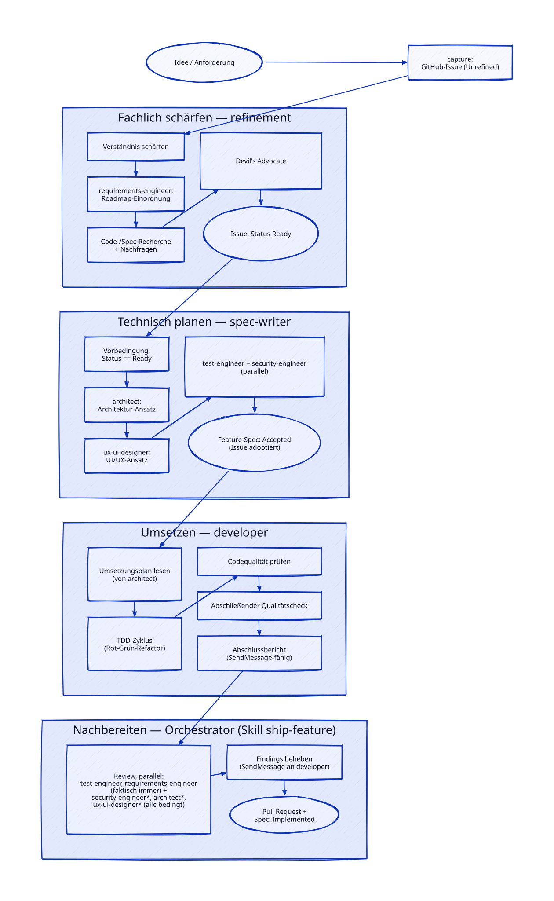

# Wie PhotoSort entwickelt wird

PhotoSort ist ein Experiment: die gesamte Entwicklung — von der ersten Idee bis zum
gemergten Pull Request — wird von KI-Agenten (Claude Code) durchgeführt. Der Mensch hinter
dem Projekt, Daniel, tritt dabei ausschließlich als Stakeholder auf: Er beschreibt
Anforderungen, Ideen und Bugs, beantwortet Rückfragen und gibt Anforderungen frei. Er schreibt
keinen Code und pflegt keine Dokumentation von Hand.

Das funktioniert, weil der Workflow bewusst kleinteilig und nachvollziehbar gehalten ist:
jede fachliche Änderung beginnt als Spezifikation, durchläuft ein festes Rollenmodell aus
spezialisierten Agenten und Skills und endet in einem klassischen, von CI abgesicherten Pull
Request. Nichts davon ist unsichtbare Magie — jeder Schritt ist als Text (Spec, ADR,
Agenten-/Skill-Definition) im Repository nachlesbar.

## Spec first

Keine fachliche oder architekturrelevante Änderung entsteht direkt im Code. Stattdessen wird
zuerst eine Spezifikation unter [`specs/features/`](../specs/features) angelegt, die einen
Lifecycle durchläuft: `Proposed` (Erstentwurf) → `Accepted` (von Daniel freigegeben) →
`Implemented` (umgesetzt, mit Verweis auf den Pull Request — gesetzt im Feature-PR selbst,
kurz vor dem Merge, siehe Schritt 7b). Architekturrelevante
Entscheidungen (neue Technologie, Datenmodell-Grundstruktur, externe Abhängigkeiten) werden
zusätzlich als Architecture Decision Record (ADR) unter [`specs/decisions/`](../specs/decisions)
festgehalten, bevor sie umgesetzt werden.

Bei Unklarheiten fragt die KI aktiv nach, statt zu raten — im Chat oder als Kommentar in einem
GitHub Issue. Erst wenn eine Spezifikation akzeptiert ist, beginnt die Implementierung.

## Der Workflow Schritte 2–8 als eine Tabelle

Von einer akzeptierten Story (Schritt 1: `refinement`, unverändert, siehe unten) bis zum Merge
läuft jedes Feature dieselbe Schritt-Kette. Diese Tabelle ist die **einzige Stelle für den
Gesamtüberblick** — jeder Schritt ist entweder ein isolierter Subagenten-Aufruf (eigener,
kontext-getrennter Lauf, gestartet über das `Agent`-Tool) oder läuft in der Hauptsession
(gemeinsamer Kontext mit dem, was Daniel gerade sieht):

| # | Schritt | Auslöser | Zuständigkeit | Subagent / Hauptsession | Modell | Bedingung |
|---|---|---|---|---|---|---|
| 2 | Spec schreiben | Story-Issue Status `Ready`, Umsetzungswunsch | Skill `spec-writer` | Hauptsession (koordiniert Konsultations-Subagenten) | Standard; Konsultationen kalibriert (siehe „Kosteneffiziente Agenten-Nutzung" unten) | immer, wenn eine `Ready`-Story umgesetzt werden soll |
| 3 | Board-Status `In Progress` | direkt vor `developer`-Start | Skill `ship-feature` (bzw. Aufrufer von `developer`) | Hauptsession (GitHub-Zugriff) | — | immer; Fehler nicht blockierend |
| 4 | Implementieren (TDD) | Feature-Spec `Accepted` | Agent `developer` | **Subagent** (Kontext-Isolation) | Standard, nie herabgestuft | immer; TDD-Pflicht nur bei Code, reine Doku ohne |
| 5 | Review | `developer`-Abschluss (`## Abschlussbericht`) | Orchestrator-Skill `review` → ruft die zutreffenden Perspektiven-Skills `review-tests` / `review-requirements` / `review-security` / `review-architecture` / `review-ux` nacheinander auf | **Hauptsession** | Hauptsession-Modell (Standard) | Perspektiven je nach Diff, siehe Trigger-Tabelle in `.claude/skills/review/SKILL.md` |
| 5b | Findings beheben | Review-Findings vorhanden | Agent `developer` (Folgeauftrag per `SendMessage`) | **Subagent** (derselbe, offen gehaltene Lauf) | Standard | nur wenn Muss-Fix-Findings vorliegen |
| 6 | PR erstellen (Body verknüpft das Issue per `Closes #NNN`) + Board-Status `Review` | Review abgeschlossen / Findings behoben | Skill `ship-feature` | Hauptsession (GitHub-Zugriff) | — | immer; die Closing-Zeile entfällt nur bei einem PR ohne Issue-Bezug |
| 7 | Copilot-Review | direkt nach der Operation `pr-erstellen` | Skill `ship-feature` | Hauptsession | — | nur wenn der Diff mindestens eine Code-Datei enthält |
| 7b | Spec finalisieren (im selben PR) | Review + Copilot ausgewertet, Findings behoben | Skill `ship-feature` (Schritt 8: `--finalize --pr-number`) | Hauptsession (GitHub-Zugriff) | — | immer; gebündelt mit dem letzten Push, damit kein Nachzieh-PR entsteht |
| 8 | Freigabe + Merge | Copilot ausgewertet, Spec finalisiert, CI grün | Daniel gibt frei, Hauptsession merged | Hauptsession | — | Daniels Freigabe ist Pflicht-Gate |

Zwischenschritt „Architektur-Konsultation nötig" (`developer` kommt mit dem Spec-Abschnitt
„Architektur / Umsetzung" nicht aus): seltener Sonderpfad — `developer` beendet den Turn mit
dem Anker `## Blockiert: Architektur-Konsultation nötig`, die Hauptsession ruft `architect` als
Subagenten (Standard-Modell) und gibt das Ergebnis per `SendMessage` an den weiterhin offenen
`developer`-Lauf zurück.



<sub>Diagramm-Quelle: [`specs/diagrams/workflow-overview.d2`](../specs/diagrams/workflow-overview.d2), gerendert per `scripts/render-diagrams.sh` (siehe ADR [`decisions/0013-diagram-tooling-d2.md`](../specs/decisions/0013-diagram-tooling-d2.md)).</sub>

## Rollen-Landkarte: warum Agent oder Skill, wo ausgeführt

Für jede Rolle ist begründet festgehalten, ob sie ein **Agent** (isolierter Subagenten-Aufruf)
oder ein **Skill** (läuft im Kontext dessen, der ihn aufruft — meist die Hauptsession) ist, und
wo sie ausgeführt wird:

| Rolle | Agent oder Skill | Ausführungsort | Begründung |
|---|---|---|---|
| `spec-writer` | Skill | Hauptsession | koordiniert Konsultationen + legt die Spec-Datei an (unter der Nummer des zugehörigen Issues); Orchestrierung mit GitHub-Zugriff (Board-Status), kein isolierter, langlaufender Arbeitsauftrag. |
| `architect` / `test-engineer` / `security-engineer` / `ux-ui-designer` / `requirements-engineer` — **Konsultation** in `spec-writer` | Agent | Subagent | echtes fachliches Vorab-Urteil auf einem großen Konzept-Dokument, Kontext-Isolation sinnvoll. |
| `developer` | Agent | **Subagent** | lange, sehr kontextintensive TDD-Umsetzung (dutzende Dateien, viele Testläufe, viele Rot-Grün-Refactor-Runden) — würde den Hauptkontext sprengen; nie modell-herabgestuft. |
| Review — Koordination | Skill `review` (Orchestrator) | **Hauptsession** | dünn: Trigger erkennen, Branch/Diff verifizieren, Trigger-Tabelle auswerten, Perspektiven-Skills nacheinander aufrufen, Findings konsolidieren. Eigenständig (auch ad hoc) aufrufbar, hält `ship-feature` schlank. |
| Review — 5 Perspektiven (Skills `review-tests` / `review-requirements` / `review-security` / `review-architecture` / `review-ux`) | Skill | **Hauptsession** | ein gemeinsames Kontext-Setup statt fünf Subagenten-Kaltstarts — die Hauptsession hat zum Review-Zeitpunkt nur den `developer`-Abschlussbericht und die Spec geladen, ist also schlank genug für Diff und Prüfpässe. Ein Review-Pass ist kurz und urteilsdicht, anders als der lange `developer`-Lauf. Je Perspektive eigenständig lesbar/testbar/pflegbar (analog zu den fünf Fachagenten-Dateien). |
| `architect` — **Umsetzungsplanung** bei „Blockiert" | Agent | Subagent | seltener Sonderpfad, echtes Entwurfsurteil, Isolation sinnvoll. |
| `ship-feature` | Skill | Hauptsession | Nachbereitungs-Orchestrierung: Board-Status, `review` aufrufen, Findings-Loop per `SendMessage` an `developer`, PR-Erstellung, Copilot-Review. GitHub-Schreibzugriff gibt es nur hier. |
| `research-engineer` | Agent | Subagent | Standard-Modell, immer; Tool-Isolation (kein `Bash`/`Write`/`Edit`/`Agent`) — Quellenbewertung ist echtes fachliches Abwägen, kein Kandidat für eine günstigere Modellstufe. |

Die fünf Fachagenten (`architect`, `test-engineer`, `security-engineer`, `requirements-engineer`,
`ux-ui-designer`) behalten damit weiterhin ihre Konzept-Dokument-Pflege und ihre
`spec-writer`-Konsultationsrolle (nur `architect` zusätzlich die Umsetzungsplanung) — entzogen
wurde ihnen ausschließlich die **Feature-Branch-Review-Rolle**: die zugehörige Prüf-Methodik ist
vollständig in den jeweiligen `review-<x>`-Skill gewandert (`.claude/skills/review-<x>/SKILL.md`),
mit einem kurzen Verweis darauf in der jeweiligen Agenten-Datei.

| Skill (Review-Perspektive) | Prüft | Konzept-Dokument |
|---|---|---|
| `review-tests` | Testabdeckung der Akzeptanzkriterien, Testqualität, klassische Bugs/Logikfehler, Code-Konventionen (ersetzt das generische Code-Review) | `specs/architecture/0002-testkonzept.md` |
| `review-requirements` | Anforderungstreue: alle Akzeptanzkriterien umgesetzt, kein Scope Creep, nichts als „Out of Scope" Ausgeschlossenes gebaut | — (Checkliste gegen die Akzeptanzkriterien der Spec) |
| `review-security` | OWASP-relevante Muster, Secrets, Eingabevalidierung, Auth-Durchsetzung | `specs/architecture/0003-securitykonzept.md` |
| `review-architecture` | Architektur-Entscheidungstreue aus drei Blickwinkeln (Pragmatiker / Senior-Entwickler / Pedant) | ADRs, `docs/architecture.md`, Spec-Abschnitt „Architektur / Umsetzung" |
| `review-ux` | Design-System-Konsistenz, Usability, Zustände (leer/ladend/Fehler), Barrierefreiheit, Responsivität | `specs/architecture/0004-design-system.md` |

Eine Idee durchläuft vor Schritt 2 zwei getrennte, unveränderte Skills: `capture` hält sie
sofort ungefiltert als GitHub-Issue fest und nimmt es ins Board auf — den Status `Unrefined`
setzt daraufhin GitHub selbst —, `refinement` übernimmt danach die
rein fachliche Schärfung (Verständnis, Prioritäts-/Reihenfolge-Einordnung über
`requirements-engineer`, Code-/Spec-Konfliktprüfung, Devil's-Advocate-Lohnenswert-Gate) und
schreibt Ziel/User Story/Akzeptanzkriterien direkt in den Issue-Body (Status `Ready`) und
schärft dabei den Issue-Titel nach, wenn er das geschärfte Ergebnis nicht mehr trifft — ohne
technische Details und ohne lokale Zwischendatei. Dieser Schritt 1 ist von dieser Konsolidierung
nicht berührt.

## Der Lebenszyklus einer Story auf dem Board

```
Unrefined → Ready → In Progress → Review → Done
```

Leitsatz: **Was GitHub selbst erkennen kann, löst GitHub aus. Was nur eine Session weiß, schreibt
die Session.** Drei der fünf Übergänge hängen deshalb an eingebauten Projects-Workflows und
laufen auf GitHubs Servern — sie funktionieren damit auch in Umgebungen, in denen ein
Board-Zugriff aus der Session heraus scheitert.

| Übergang | Ausgelöst durch | Geschrieben von |
|---|---|---|
| → `Unrefined` | Das Issue wird ins Projekt aufgenommen | GitHub, Workflow `Item added to project` |
| → `Ready` | `refinement` hat die Story fachlich geschärft | Session (`refinement`) |
| → `In Progress` | `spec-writer` beginnt — vor Branch und Spec-Datei | Session (`spec-writer`) |
| → `Review` | Ein Pull Request verweist per `Closes #NNN` auf das Issue | GitHub, Workflow `Pull request linked to issue` |
| → `Done` | Das Issue wird geschlossen (Regelweg: Merge über das Keyword) | GitHub, Workflow `Item closed` |
| → `In Progress` (zurück) | Ein Pull Request wird ohne Merge geschlossen | Session (`ship-feature`) |

Die Arbeit gilt als begonnen, sobald sie begonnen wird — **das Schreiben der Spec zählt bereits
dazu**. `Done` heißt „vom Board", nicht „ausgeliefert": Auch eine ohne Umsetzung verworfene Story
landet dort, den Unterschied trägt GitHubs Close-Grund (`not planned` gegenüber `completed`).

Der lokale Spec-Datei-Lebenszyklus (`Proposed → Accepted → Implemented → Superseded`,
`specs/README.md`) ist davon unberührt.

## Testgetrieben, mit hartem Gate

Jede Implementierung folgt strikt Test-Driven Development: Kein Code ohne vorher geschriebene,
zunächst fehlschlagende Tests. Ein Coverage-Gate in der CI erzwingt mindestens 80% Backend-Testabdeckung;
unterschreitet ein Pull Request diese Schwelle, kann er nicht gemergt werden.

## Zwei Arbeitsmodi

- **Interaktive Sessions:** Daniel bespricht Anforderungen, Ideen und Bugs direkt mit
  Claude Code im Repository — geeignet für Diskussion, Spec-Verfeinerung und größere oder
  mehrdeutige Themen.
- **Hintergrund-Automatisierung (Ausbaustufe):** GitHub Issues mit einer klar definierten,
  akzeptierten Spec können künftig von einem automatisiert laufenden Agenten selbstständig
  abgearbeitet werden, ohne dass Daniel live mitliest. Blockierende Unklarheiten werden dann
  als Issue-Kommentar zurückgemeldet statt geraten. Diese Automatisierung ist zum
  Zeitpunkt dieser Beschreibung noch nicht eingerichtet.

**Remote-/Cloud-Sessions sind ein vollwertiger Arbeitsmodus.** Jeder GitHub-Zugriff läuft über
eine Operation des Skills `github-access`, und jede Operation kennt ihre Zugangswege in fester
Reihenfolge (siehe
[ADR 0060](../specs/decisions/0060-ein-ort-fuer-jeden-github-zugriff-wege-in-fester-reihenfolge.md)).
Es wird **nicht** vorab gemessen, ob ein Weg trägt, und aus keinem Umgebungsmerkmal auf eine
Session-Art geschlossen — die Operation wird ausgeführt, denn sie zu versuchen kostet nicht mehr,
als sie zu messen. Scheitert ein Weg, wird der nächste versucht; ein Wegwechsel ist kein Befund
und wird nicht berichtet.

Damit tragen in einer Cloud-Session **alle Issue- und alle Pull-Request-Schritte**: Eine Story
kommt dort von der Erfassung bis zum eröffneten, verknüpften, von Copilot reviewten Pull Request,
und danach von selbst auf `Review` und `Done`, weil diese beiden Übergänge auf GitHubs Servern
entstehen. Was dort über **keinen** Weg trägt, sind die vier Board-Operationen — Projects (V2)
spricht ausschließlich GraphQL, und das ist in solchen Sessions gesperrt. Übrig bleiben zwei
Etiketten (`Ready`, `In Progress`) und die Board-Aufnahme eines neuen Issues. Sie erscheinen im
Abschlussbericht unter `## Lokal nachzuholen`, mit dem unverändert wiederholbaren Befehl aus dem
Katalogeintrag — als Normalfall dieser Umgebung, nicht als Fehler, für den eine Behebung zu
suchen wäre. Details in [`docs/setup.md`](./setup.md), Abschnitt „GitHub-CLI (`gh`)".

## Kosteneffiziente Agenten-Nutzung

Da Claude-Code-Subagenten-Aufrufe ein spürbarer Verbrauchsposten auf Daniels Nutzungskontingent
sind, ist die Review-Phase (Schritt 5) bewusst darauf ausgelegt, keinen der fünf früheren
Review-Subagenten-Kaltstarts mehr zu bezahlen: die fünf Perspektiven laufen als Skills im
bereits geladenen Hauptsession-Kontext, koordiniert vom dünnen `review`-Orchestrator. Welche
Perspektiven tatsächlich laufen, entscheidet weiterhin eine feste, aus dem Diff mechanisch
ableitbare Trigger-Tabelle (gepflegt in `.claude/skills/review/SKILL.md`): `review-tests` und
`review-requirements` laufen faktisch immer (jede Umsetzung bringt per TDD-Zwang Code+Tests und
per Definition zu prüfende Akzeptanzkriterien mit), `review-security`, `review-architecture` und
`review-ux` nur, wenn der Diff einen ihrer dokumentierten Trigger berührt (z.B.
Auth-/Secrets-Pfade, neue Abhängigkeiten, Frontend-Dateien). Sicherheitsnetz: Ist die Zuordnung
unklar, läuft die Perspektive trotzdem — die Tabelle ist bewusst konservativ statt aggressiv
Kontingent sparend.

Eine feste Modellzuweisung pro Perspektive (früher: Haiku für die beiden checklistenartigsten
Perspektiven, Anforderungstreue und UI/UX) entfällt ersatzlos — es gibt keinen eigenen,
modell-wählbaren Subagenten-Aufruf mehr, alle fünf Perspektiven laufen im
Hauptsession-Modell (Standard). Das ist kein Qualitätsverlust: die beiden vormals auf Haiku
gestellten Perspektiven waren gerade wegen ihres checklistenartigen Charakters dafür geeignet —
im stärkeren Hauptsession-Modell geprüft ist das eher ein Qualitätsgewinn. Die Ersparnis kommt
vollständig aus dem Wegfall der fünf Subagenten-Kaltstarts, nicht aus einer Modellstufe.

**Kostenabschätzung (mit Annahmen, keine Scheinpräzision):** Ein Review-Subagenten-Kaltstart
kostete grob 30–70k Token (CLAUDE.md + `specs/README.md` + Konzept-Dokument-Auszug + Diff + Spec
+ Reasoning + Bericht) — fünf davon ≈ 200–350k Token pro Feature, bei jedem Feature. Die fünf
Perspektiven-Skills laufen dagegen im bereits geladenen Hauptsession-Kontext; jeder Skill fügt
nur seine Skill-Anweisung + Konzept-Dokument-Auszug + Reasoning + Findings hinzu ≈ 15–40k Token,
macht zusammen mit dem dünnen Orchestrator ≈ 90–210k Token, die sich im Hauptfenster
akkumulieren (bei einem Doku-Diff mit nur zwei zutreffenden Perspektiven entsprechend weniger,
~40–90k). Netto rund **40–55 % Reduktion der Review-Phase** — weniger als ein einziger
gemeinsamer Skill gebracht hätte (dort ~60–75 %), weil fünf getrennte Skill-Anweisungen geladen
werden und jeder Skill sein Konzept-Dokument separat konsultiert; der dominierende Hebel
(Wegfall von 5× vollständigem Agenten-Kaltstart) bleibt aber erhalten. Laufzeit/Latenz sind
dagegen schlechter als zuvor — fünf sequenzielle Durchläufe in der Hauptsession statt einer
parallelen Subagenten-Runde; für ein Solo-Projekt ohne Latenz-SLA bewusst akzeptiert. Insgesamt
sinkt ein Feature-Lauf von ~8–12 auf ~3–6 Subagenten-Aufrufe (`spec-writer` + bis zu 3
Konsultationen unverändert + `developer` + ggf. `developer`-Folgeauftrag; Review = 0
Subagenten-Aufrufe mehr).

Dieselbe Kosten-Logik gilt unverändert für den Verfeinerungs-Ablauf selbst
([ADR 0018](../specs/decisions/0018-idea-sharpener-kalibrierung-und-skip-logik.md) und
[ADR 0038](../specs/decisions/0038-spec-writer-skip-schwelle-lockern-refinement-vorfilterung.md),
seit ADR 0036 auf zwei Skills verteilt): In `refinement` laufen die Konsultation von
`requirements-engineer` sowie die beiden optionalen Explore-Agenten mit Haiku statt Standard und
immer (keine Skip-Option). In `spec-writer` läuft `ux-ui-designer` ebenfalls mit Haiku, während
`architect`, `test-engineer` und `security-engineer` beim Standardmodell bleiben. Zusätzlich
steht vor jeder `architect`/`ux-ui-designer`/`test-engineer`/`security-engineer`-Konsultation in
`spec-writer` je eine eng gefasste, dokumentationspflichtige Ja/Nein-Skip-Frage — urteilsbasiert
statt mechanisch, da vor der eigentlichen Umsetzung noch kein Diff existiert. Seit ADR 0038 ist
deren Schwelle für alle vier Konsultationen bewusst gelockert: übersprungen wird, solange die
Story keinen **konkret benennbaren** Anhaltspunkt für den jeweiligen Zuständigkeitsbereich hat;
ein rein theoretischer Restzweifel zwingt nicht mehr zum Aufruf. Ein dadurch übersehener Bedarf
wird als Zweitlinie von der Review-Runde (Schritt 5) und der laufenden Qualitätsbeobachtung
aufgefangen. Ergänzend verschärft ADR 0038 in `refinement` den Devil's-Advocate-Schritt zu einem
eigenständigen, immer durchlaufenden Lohnenswert-Gate mit explizitem Ja/Nein-Urteil.

Aufrufe des `research-engineer`-Agenten (direkt von Daniel oder delegiert von einem der fünf
Fachagenten bzw. aus einem `review-*`-Skill heraus, siehe
[ADR 0016](../specs/decisions/0016-research-engineer-agent.md)) laufen immer mit dem
Standardmodell, ohne Ausnahme — Quellenbewertung ist echtes fachliches Abwägen ohne feste
Checkliste, kein Kandidat für die günstigere Modellstufe.

## Wo die eigentlichen Regeln stehen

Diese Seite erklärt das Prinzip für Außenstehende. Die tatsächlich verbindliche, maschinenlesbare
Regel-Quelle, nach der sich jeder Agent/Skill richtet, ist [`CLAUDE.md`](../CLAUDE.md) im
Wurzelverzeichnis des Repositories — im Verfassungsstil geschrieben und die einzige Quelle, die
bei Widersprüchen zwischen dieser Beschreibung und der tatsächlichen Praxis maßgeblich ist. Die
Schritt-Tabelle und die Rollen-Landkarte oben sind die aufbereitete Zusammenfassung von
ADR [`decisions/0040-ki-workflow-schritte-2-8-konsolidiert.md`](../specs/decisions/0040-ki-workflow-schritte-2-8-konsolidiert.md),
die als einzige konsolidierende ADR den vorher über sieben Einzel-ADRs verstreuten Workflow für
Schritte 2–8 zusammenführt.
