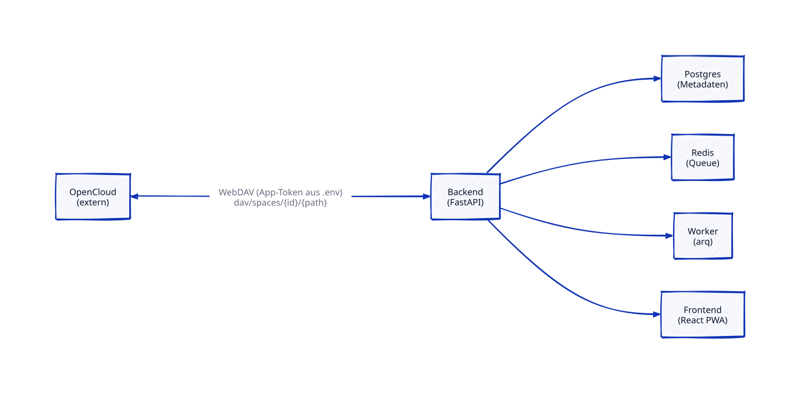

# Architektur-Übersicht

**Status:** Living Document (kein Lifecycle, wird laufend aktualisiert)
**Letzte Aktualisierung:** 2026-08-05 (Spec "Doku-Restrukturierung" (0019) umgesetzt: Datei per `git mv` aus `specs/architecture/0001-overview.md` hierher verschoben, Wegweiser-Tabellen in README/`CLAUDE.md`/`specs/README.md` entsprechend aktualisiert — Historie bleibt über `git log --follow` nachvollziehbar. ASCII-Systemkontext-Diagramm durch [`specs/diagrams/component-overview.d2`](../specs/diagrams/component-overview.d2)/`.svg` ersetzt, siehe ADR [`decisions/0013-diagram-tooling-d2.md`](../specs/decisions/0013-diagram-tooling-d2.md). Inhaltlich unverändert gegenüber dem vorherigen Stand.) Zuvor am 2026-07-28 (Spec "Automatische Auswahl der besten Fotos" (0003, Phase A) umgesetzt: `score_project`-Job, `scoring.py` (reine Heuristik-Funktionen), `PhotoScore`/`ScoringRun`-Tabellen, `POST /projects/{id}/score`, `PhotoOut.suggestion` — siehe Feature-Branch `feature/0003-automatic-best-photo-selection` und [`decisions/0006-local-scoring-datamodel.md`](../specs/decisions/0006-local-scoring-datamodel.md). Zuvor am 2026-07-27: Architektur-Ansatz fuer Spec 0003 festgelegt, Datenmodell verfeinert, noch nicht implementiert. Zuvor am selben Tag: Spec "Manuelle Kategorisierung" (0002) umgesetzt: `Rating`-Modell, Foto-Listing/-Filter/-Pagination, Bild-Streaming-Endpunkt, Thumbnail-/Display-Erzeugung im Worker, Grid-/Einzelbild-/Vergleichsansicht im Frontend — siehe Feature-Branch `feature/0002-manual-categorization`. Zuvor am 2026-07-21: Spec "Auth-Implementierung" (0006) umgesetzt: `POST /auth/login`, `get_current_user`-Dependency, `User`-Modell, Seed-Migration, Frontend-Login-Flow — siehe Feature-Branch `feature/0006-auth`. Zuvor am 2026-07-20: Auth-Ansatz — JWT via Bearer-Header, Argon2/PyJWT — gemäß [`decisions/0005-auth-implementation.md`](../specs/decisions/0005-auth-implementation.md) entschieden; Frontend-Grundgerüst — Routing/Server-State — gemäß [`decisions/0004-frontend-app-shell.md`](../specs/decisions/0004-frontend-app-shell.md))

## Systemkontext

PhotoSort verwaltet keine eigenen Bilddateien dauerhaft — die Fotos bleiben auf einer externen **OpenCloud**-Instanz. PhotoSort speichert Metadaten, Bewertungen und einen lokalen Verarbeitungs-Cache (Thumbnails).

Diagramm-Quelle: [`specs/diagrams/component-overview.d2`](../specs/diagrams/component-overview.d2), gerendert per `scripts/render-diagrams.sh` (siehe ADR [`decisions/0013-diagram-tooling-d2.md`](../specs/decisions/0013-diagram-tooling-d2.md)).

## Komponenten

- **Frontend** (`frontend/`): React + TypeScript + Vite, als PWA installierbar. Kommuniziert ausschließlich über die Backend-API (kein direkter OpenCloud-Zugriff vom Client aus, um App-Tokens nicht im Browser zu exponieren). Routing (`react-router`) und Server-State/Datenzugriff (`@tanstack/react-query` über einen schlanken Fetch-Wrapper, `api/client.ts`) gemäß [`decisions/0004-frontend-app-shell.md`](../specs/decisions/0004-frontend-app-shell.md) — mit Spec 0006 (Auth) eingeführt (Login-Route/geschützte Routen benötigten bereits Routing), Spec 0005 baut die restlichen Projekt-Routen direkt darauf auf. `api/client.ts` hängt bei vorhandenem Token automatisch `Authorization: Bearer <token>` an (Token aus `localStorage`, siehe [`decisions/0005-auth-implementation.md`](../specs/decisions/0005-auth-implementation.md)) und löst bei 401-Antworten zentral die Abmeldung/Weiterleitung zu `/login` aus.
- **Backend** (`backend/`): FastAPI. REST-API für Projekte, Fotos, Bewertungen; Auth (JWT, `Authorization: Bearer`-Header, kein Cookie); Anbindung an OpenCloud via WebDAV; stößt Hintergrund-Jobs im Worker an. **Implementiert (Spec 0001):** `/opencloud/browse`, `/projects` (CRUD + Scan-Trigger), OpenCloud-Client (`opencloud/client.py`, `opencloud/webdav_xml.py`, `opencloud/exif.py`). **Implementiert (Spec 0006):** `POST /auth/login`, `get_current_user`-Dependency (Argon2/PyJWT gemäß [`decisions/0005-auth-implementation.md`](../specs/decisions/0005-auth-implementation.md)), `/projects`- und `/opencloud`-Router sind auth-pflichtig (Router-Level-Dependency). **Implementiert (Spec 0002):** `GET /projects/{id}/photos` (Listing/Filter/Pagination), `GET /photos/{id}/image` (Thumbnail-/Display-Streaming aus dem lokalen Cache), `PUT`/`DELETE /photos/{id}/rating` (`api/photos.py`, `api/ratings.py`) — auth-pflichtig per Endpoint-Dependency statt Router-Level-Dependency, da beide Router mehrere URL-Präfixe bedienen und den `User` ohnehin für die Bewertungszuordnung brauchen. **Implementiert (Spec 0003, Phase A):** `POST /projects/{id}/score` (`api/projects.py`, analog `POST /projects/{id}/scan`, gleicher Router-Level-Auth-Guard), `PhotoOut.suggestion` (`api/photos.py`, nur befüllt ohne eigenes `Rating`), `ProjectOut.last_scoring_run` (analog `last_scan`).
- **Worker** (`backend/`, eigener Container-Prozess): `arq`-basierte Jobs für Foto-Ingest (Listing, Download, Thumbnail-Erzeugung), lokale Heuristik-Berechnung und optionale Cloud-KI-Bewertung. Siehe [`decisions/0002-hybrid-ai-scoring.md`](../specs/decisions/0002-hybrid-ai-scoring.md). **Implementiert (Spec 0001):** `scan_project`-Job (`worker.py`) für Foto-Ingest. **Implementiert (Spec 0002):** Thumbnail-/Display-Erzeugung (`thumbnails.py`, Pillow) beim Scan, Ablage im lokalen Cache (Docker-Volume `photo_cache`), Dateiname deterministisch aus `photo_id`+`etag` (kein neues DB-Feld). **Implementiert (Spec 0003, Phase A):** `score_project`-Job (`worker.py::run_project_scoring`, analog zu `scan_project`), reine Heuristik-Funktionen in `scoring.py` (analog zu `thumbnails.py`: Schärfe/Belichtung/dHash+Hamming-Distanz, Duplikat-/Zeitfenster-Clustering), operiert auf der bereits vom Scan gecachten `display`-Variante — kein erneuter OpenCloud-Download für Phase A. Details siehe [`decisions/0006-local-scoring-datamodel.md`](../specs/decisions/0006-local-scoring-datamodel.md).
- **Postgres**: Metadaten (Projekte, Fotos, Bewertungen, Nutzer), keine Bilddaten.
- **Redis**: Job-Queue für den Worker.
- **Lokaler Cache**: Docker-Volume für Thumbnails/Zwischenergebnisse, kein Ersatz für OpenCloud als Quelle der Wahrheit.

## Datenmodell (Skizze, wird pro Feature-Spec verfeinert)

- **User** *(implementiert, Spec 0006, `models.py`)*: Account (Daniel, Ehefrau), getrennt authentifiziert — `username` (frei, kein festes Enum) + `password_hash` (Argon2). Initial über eine idempotente Alembic-Seed-Migration angelegt, Passwörter aus Umgebungsvariablen. Künftiges `Rating` (Spec 0002) referenziert `User` über `user_id`.
- **Project** *(implementiert, `models.py`)*: z.B. "Costa Rica"; referenziert genau einen OpenCloud-Ordner (rekursiv inkl. Unterordner) über `opencloud_drive_id` + `opencloud_path`.
- **OpenCloud-Verbindung**: kein eigenes DB-Modell — eine einzige, instanzweite Verbindung, konfiguriert über `OPENCLOUD_BASE_URL`/`OPENCLOUD_USERNAME`/`OPENCLOUD_APP_TOKEN`/`OPENCLOUD_DRIVE_NAME` in `.env`. Details siehe [`features/0001-opencloud-project-connection.md`](../specs/features/0001-opencloud-project-connection.md).
- **Photo** *(implementiert, `models.py`)*: gehört zu einem Project, referenziert `relative_path`/`etag` auf OpenCloud, `taken_at`/`last_modified`, `content_length`. Nur JPEG/PNG/HEIC (MVP).
- **ScanRun** *(implementiert, `models.py`)*: ein (Re-)Scan-Lauf eines Projekts — Status (`running`/`success`/`failed`), Zähler (`files_found`, `photos_added`, `photos_updated`, `photos_removed`, `files_skipped`), `error_message` bei Fehlern. Liefert die Zusammenfassung, die über `GET /projects/{id}` als `last_scan` ausgegeben wird.
- **PhotoScore** *(implementiert, Spec 0003, `models.py`, Datenmodell festgelegt in [`decisions/0006-local-scoring-datamodel.md`](../specs/decisions/0006-local-scoring-datamodel.md))*: 1:1 zu `Photo` (`photo_id` als Primary Key). Ergebnis der lokalen Heuristiken aus Phase A: `sharpness`, `exposure`, `phash` (dHash, ohne neue Abhängigkeit direkt mit Pillow berechnet), `duplicate_of` (selbstreferenzierender FK auf `photos.id`), `cluster_key`, `local_quality_score`, `suggested_status` (wiederverwendet `RatingStatus`), `computed_at`. Bewusst getrennt von `Rating` — ein automatischer Vorschlag ist nie eine `Rating`-Zeile, sondern wird der API/dem Frontend als eigenes Feld `PhotoOut.suggestion` neben `ratings` angeboten; erst eine explizite Nutzerbestätigung erzeugt eine echte `Rating`-Zeile über den bestehenden `PUT /photos/{id}/rating`-Endpunkt. `cloud_aesthetic_score` (Phase B) ist bewusst noch nicht angelegt.
- **ScoringRun** *(implementiert, Spec 0003, `models.py`)*: ein Lauf des Phase-A-Scoring-Jobs, analog zu `ScanRun` (nutzt bewusst denselben `ScanStatus`-Enum statt eines eigenen, identische running/success/failed-Semantik), aber mit `photos_total`/`photos_processed` für granularen, periodisch zwischen-committeten Live-Fortschritt (nicht nur laufend/fertig wie beim Scan) — siehe [`decisions/0006-local-scoring-datamodel.md`](../specs/decisions/0006-local-scoring-datamodel.md). Liefert die Zusammenfassung, die über `GET /projects/{id}` als `last_scoring_run` ausgegeben wird.
- **Rating** *(implementiert, Spec 0002, `models.py`)*: Bewertung eines Photos durch einen User (`favorite` / `album_worthy` / `rejected`), pro User getrennt gespeichert; Unique-Constraint `(photo_id, user_id)`, "unbewertet" = fehlende Zeile (kein Enum-Wert). Bleibt mit Spec 0003 unverändert (keine neue Spalte, keine Migration bestehender Daten) — siehe ADR 0006.

## Bewusste Annahmen (können per ADR/Spec revidiert werden)

- Kein eingebauter Reverse Proxy/TLS in `docker-compose.yml` — das Homeserver-Setup von Daniel übernimmt das.
- CPU-only-Betrieb: alle lokalen KI-Heuristiken müssen ohne GPU praktikabel laufen.
- Cloud-KI-Aufrufe (Phase B des Scorings) sind immer optional/on-demand, nie Voraussetzung für die Kernfunktion.
