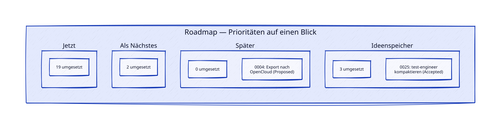

# Roadmap

Lebendes Dokument, gepflegt vom `requirements-engineer`-Agenten. Enthält die Priorisierung und den Status-Überblick der Features — die eigentliche fachliche Wahrheit steht in den einzelnen Spec-Dateien unter `specs/features/`, hier nur Reihenfolge/Einordnung darüber. Kein Lifecycle wie bei Specs, wird laufend aktualisiert.

## Status auf einen Blick

*Grafik zeigt nur offene (nicht-implementierte) Specs als Einzelkarte, siehe Tabelle unten für den vollständigen Stand. Wird vom `requirements-engineer` mitaktualisiert, siehe Kopfkommentar in [`diagrams/roadmap-overview.d2`](./diagrams/roadmap-overview.d2).*

| Spec | Titel | Status |
|---|---|---|
| [0001](./features/0001-opencloud-project-connection.md) | OpenCloud-Projekt-Anbindung | Implemented (Backend) — Frontend-Oberfläche und API-Authentifizierung noch offen, siehe Abhängigkeiten unten |
| [0002](./features/0002-manual-categorization.md) | Manuelle Kategorisierung | Implemented ([PR #3](https://github.com/TheRealKoller/photosort/pull/3)) |
| [0003](./features/0003-automatic-best-photo-selection.md) | Automatische Vorauswahl (Phase A) | Implemented ([PR #6](https://github.com/TheRealKoller/photosort/pull/6)) |
| [0004](./features/0004-opencloud-export.md) | Export nach OpenCloud | Proposed |
| [0005](./features/0005-minimal-project-frontend.md) | Minimales Projekt-Frontend | Implemented ([PR #2](https://github.com/TheRealKoller/photosort/pull/2)) |
| [0006](./features/0006-auth.md) | Auth-Implementierung | Implemented ([PR #1](https://github.com/TheRealKoller/photosort/pull/1)) |
| [0007](./features/0007-github-repo-access-hardening.md) | GitHub-Repo-Zugriffshärtung & Issue-Freigabe-Vorsorge | Implemented ([PR #5](https://github.com/TheRealKoller/photosort/pull/5)) |
| [0008](./features/0008-automated-semver-releases.md) | Automatisierte SemVer-Releases bei Merge nach `main` | Implemented ([PR #46](https://github.com/TheRealKoller/photosort/pull/46)) |
| [0009](./features/0009-local-opencloud-demo-stack.md) | Lokal ausprobieren ohne echten OpenCloud-Server | Implemented ([PR #11](https://github.com/TheRealKoller/photosort/pull/11)) |
| [0010](./features/0010-explicit-ipv4-only-network.md) | Explizites IPv4-only Docker-Netzwerk | Implemented ([PR #15](https://github.com/TheRealKoller/photosort/pull/15)) |
| [0011](./features/0011-least-privilege-ci-token-permissions.md) | Least-Privilege `GITHUB_TOKEN`-Berechtigungen in `ci.yml` | Implemented ([PR #14](https://github.com/TheRealKoller/photosort/pull/14)) |
| [0012](./features/0012-visual-redesign.md) | Visuelles Redesign & UI-Komponentenbibliothek | Implemented ([PR #20](https://github.com/TheRealKoller/photosort/pull/20), [PR #21](https://github.com/TheRealKoller/photosort/pull/21)) |
| [0013](./features/0013-single-service-migration-ownership.md) | Alembic-Migrationen ausschließlich in `backend` ausführen | Implemented ([PR #16](https://github.com/TheRealKoller/photosort/pull/16)) |
| [0014](./features/0014-react-router-rsc-csrf-fix.md) | `react-router`-Update gegen Dependabot-Alert #2 (RSC-Mode-CSRF) | Implemented ([PR #24](https://github.com/TheRealKoller/photosort/pull/24)) |
| [0015](./features/0015-npm-transitive-dependency-security-updates.md) | npm-Sicherheitsupdates für transitive Dependencies (`fast-uri`, `undici`) | Implemented ([PR #22](https://github.com/TheRealKoller/photosort/pull/22)) |
| [0016](./features/0016-spa-fallback-frontend-nginx.md) | SPA-Fallback in der Frontend-nginx-Konfiguration | Implemented ([PR #35](https://github.com/TheRealKoller/photosort/pull/35)) |
| [0017](./features/0017-trigger-bridge-fast-path-fix.md) | Fortschrittsbalken/Button hängen bei schnellen Scan-/Scoring-Läufen | Implemented ([PR #28](https://github.com/TheRealKoller/photosort/pull/28)) |
| [0018](./features/0018-diagram-tooling-migration.md) | Diagramm-Tooling: Migration von Mermaid zu D2 | Implemented ([PR #29](https://github.com/TheRealKoller/photosort/pull/29)) |
| [0019](./features/0019-docs-restructure.md) | Doku-Restrukturierung: neuer `docs/`-Ordner, schlanke README | Implemented ([PR #31](https://github.com/TheRealKoller/photosort/pull/31)) |
| [0020](./features/0020-agenten-review-optimierung.md) | Agenten-Nutzung im Review optimieren (bedingte Review-Agenten + situative Modellzuweisung) | Implemented ([PR #32](https://github.com/TheRealKoller/photosort/pull/32) für AK13, [PR #34](https://github.com/TheRealKoller/photosort/pull/34) für AK1–AK12) |
| [0021](./features/0021-scoring-run-vorschlagszaehler.md) | Zusammenfassung nach Scoring-Lauf: Anzahl gefundener Vorschläge | Implemented ([PR #38](https://github.com/TheRealKoller/photosort/pull/38)) |
| [0022](./features/0022-scan-live-fortschrittszaehler.md) | Live-Fortschrittszähler beim Scannen eines Projekts | Implemented ([PR #40](https://github.com/TheRealKoller/photosort/pull/40)) |
| [0023](./features/0023-scan-fortschritt-batch-groesse-fix.md) | Scan-Zuverlässigkeit: hängender Job + eingefrorener Live-Zähler | Implemented ([PR #43](https://github.com/TheRealKoller/photosort/pull/43)) |
| [0024](./features/0024-top-photo-selection-category-mix.md) | Top-Fotos auswählen mit Kategorie-Mix (lokal) | Accepted |
| [0025](./features/0025-test-engineer-review-kompaktierung.md) | `test-engineer` kompaktieren: TDD-Ritual-Check raus, Instruktionen straffen | Accepted |
| [0026](./features/0026-roadmap-kompaktuebersicht-und-readme-link.md) | Roadmap-Kompaktübersicht (D2-Grafik) und README-Verlinkung | Accepted |

## Priorisierung

### Jetzt

- ~~**Zusammenfassung nach Scoring-Lauf: Anzahl gefundener Vorschläge**~~ — [`specs/features/0021-scoring-run-vorschlagszaehler.md`](./features/0021-scoring-run-vorschlagszaehler.md) (Status: **Implemented**, [PR #38](https://github.com/TheRealKoller/photosort/pull/38), 2026-08-07), geschärft aus Bug-Report `specs/inbox/0005-keine-sichtbaren-automatischen-vorschlaege.md` (Daniel selbst, interaktive Session; Inbox-Notiz nach Aufnahme in diese Spec gelöscht). Der vermeintliche Bug war keiner (Spec 0003/ADR 0006 spricht in Phase A bewusst nie eine positive Empfehlung aus) — der eigentliche Missstand war der in Spec 0003 als Nice-to-have vorgesehene, nie umgesetzte Zähler. Nachgeholt: `ScoringRun.suggestions_found` (additive Migration), gesetzt vom Worker nach der Duplikat-/Cluster-Erkennung (`len(rejected_ids)`), bleibt bei einem fehlgeschlagenen Lauf auf Default `0`. `ScoringRunSummary` (Backend + Frontend) und `ProjectDetailPage.tsx` zeigen jetzt "N Vorschläge gefunden" (Singular bei N=1) statt des bisherigen generischen Texts, `aria-live`-Verhalten unverändert. Alle fünf Review-Agenten ohne Must-Fix-Findings.
- ~~**Fortschrittsbalken/Button hängen bei "Beste Fotos automatisch vorschlagen" bei schnellen Scoring-Läufen**~~ — [`specs/features/0017-trigger-bridge-fast-path-fix.md`](./features/0017-trigger-bridge-fast-path-fix.md) (Status: **Implemented**, [PR #28](https://github.com/TheRealKoller/photosort/pull/28), 2026-08-05), geschärft aus Bug-Report `specs/inbox/0001-fortschrittsbalken-verschwindet-bei-vorauswahl.md` (Daniel selbst, interaktive Session; Inbox-Notiz nach Aufnahme in diese Spec gelöscht, daher hier nur noch als Text statt als Link genannt). Root Cause bestätigt: der Bridging-Effekt für Scan-/Scoring-Trigger in `ProjectDetailPage.tsx` setzte sein `awaiting*Confirmation`-Flag nur bei beobachtetem Zwischenzustand `running` zurück — lief ein Job so schnell durch (z.B. Scoring bei < 25 Fotos, ~6ms ohne `await`-Punkt im Worker), dass `running` beim 2-Sekunden-Polling nie beobachtet wurde, blieb der Button dauerhaft busy. Fix: beide fast identischen Effekte zu einem gemeinsamen, dateilokalen Hook `useTriggerConfirmation` zusammengeführt, der das Flag jetzt auch bei direktem Sprung auf `success`/`failed` zurücksetzt (unterscheidet dabei per `started_at`-Vergleich einen genuinely neuen Lauf von einem stehengebliebenen, stale Status des vorherigen Laufs, um eine bestehende Anti-Regressions-Testerwartung nicht zu brechen). Zusätzlich die `!isScoreBusy`-Gate-Bedingung auf der Scoring-Fehler-Alert entfernt. 5 neue Regressionstests, alle Reviews (test-engineer, security-engineer, architect, requirements-engineer) ohne verbleibende Must-Fix-Findings.
- ~~**F5-Browser-Refresh liefert 404 (SPA-Fallback in nginx fehlt)**~~ — [`specs/features/0016-spa-fallback-frontend-nginx.md`](./features/0016-spa-fallback-frontend-nginx.md) (Status: **Implemented**, [PR #35](https://github.com/TheRealKoller/photosort/pull/35), 2026-08-07), geschärft aus Bug-Report `specs/inbox/0002-f5-refresh-404.md` (Daniel selbst, interaktive Session; Inbox-Notiz nach Aufnahme in diese Spec gelöscht, daher hier nur noch als Text statt als Link genannt). **Root Cause bereits im Code verifiziert:** `frontend/Dockerfile` baut das Vite-Bundle und kopiert es unverändert in ein `nginx:1.27-alpine`-Image, ohne eigene `nginx.conf` per `COPY` einzubinden — es läuft die nginx-Default-Config, die keinen SPA-Fallback (`try_files $uri $uri/ /index.html;`) kennt. Ein direkter Request auf einen client-seitigen Pfad wie `/projects/3` (z.B. durch F5 nach vorheriger Client-Navigation) findet keine gleichnamige Datei im statischen Bundle und liefert 404, statt `index.html` auszuliefern und React Router client-seitig rendern zu lassen. **Betroffener Service:** einziger `frontend`-Service in `docker-compose.yml` (Port 8080→80); wird unverändert auch vom additiven Demo-Overlay `docker-compose.demo.yml` genutzt (kein eigener `frontend`-Override dort) — ein Fix im gemeinsamen Dockerfile/Image wirkt für beide Stacks, kein separater Fix pro Stack nötig. **Kein Konflikt mit Spec 0012 (Implemented, visuelles Redesign) geprüft:** 0012 war eine reine Tailwind/Radix/shadcn-Styling-Migration innerhalb der React-App selbst, ohne jede Änderung an `frontend/Dockerfile`, Build-Pipeline oder nginx — komplett andere Dateien, keine Überschneidung. Priorität "Jetzt" gerechtfertigt: aktiver, reproduzierbarer Bug mit direkter, alltäglicher Nutzerauswirkung (jeder F5-Refresh nach einer Navigation bricht), kein erkennbarer Konflikt mit laufender oder geplanter Arbeit — keine Rückfrage an Daniel nötig. **Fix umgesetzt:** neue `frontend/nginx.conf` mit `try_files`-basiertem SPA-Fallback, per `COPY` in `frontend/Dockerfile` eingebunden; permanenter funktionaler CI-Check im `docker-compose-check`-Job (analog Spec 0010/0013). Bei der Umsetzung entdeckt und korrigiert: die ursprünglich in der Spec vorgeschlagene minimale `try_files`-Regel allein hätte das eigene Akzeptanzkriterium "nicht existierendes asset-artiges Pfad bleibt 404" verletzt — ein zusätzlicher `location /assets/ { try_files $uri =404; }`-Block behebt das (Details siehe Spec, Abschnitt "Entscheidungen").
- ~~**Alembic-Migrationen ausschließlich in `backend` ausführen**~~ — [`specs/features/0013-single-service-migration-ownership.md`](./features/0013-single-service-migration-ownership.md) (Status: **Implemented**, [PR #16](https://github.com/TheRealKoller/photosort/pull/16), 2026-08-03). `backend` und `worker` führten bisher beide unabhängig `alembic upgrade head && ...` beim Start aus, hingen per `depends_on` aber nur an `postgres`/`redis` (`service_healthy`), nicht aneinander — gegen eine frisch angelegte, leere Datenbank kollidierten beide beim Anlegen von `alembic_version`. **Konkret bei Daniel beobachtet** (nicht hypothetisch): nach Löschen von `postgres`-Container+Volume und Neu-Deploy über die externe Dockhand-Instanz trat `duplicate key value violates unique constraint "pg_type_typname_nsp_index"` auf, Folge eine unvollständig durchgelaufene Migrationskette (inkl. Auth-Seed-Migration `1574f8180817_seed_auth_users.py`) und dadurch der vorgelagert beobachtete 401-Login-Fehler. Fix laut ADR [`decisions/0012-single-service-migration-ownership.md`](./decisions/0012-single-service-migration-ownership.md) umgesetzt: Migration läuft nur noch in `backend`, `worker` wartet per neuem Compose-Healthcheck (`depends_on: backend: condition: service_healthy`) statt selbst zu migrieren — macht die Race strukturell unmöglich statt sie nur zu entschärfen, per lokalem Docker-Repro vor dem Fix als real bestätigt (genau der produktive Fehler wurde reproduziert). Zwei neue permanente Prüfungen im `docker-compose-check`-CI-Job (statischer Check + funktionaler Smoke-Test gegen frische DB).
- ~~**`OpenCloudClient.list_drives` liest `webDavUrl` an der falschen Stelle — bricht `GET /opencloud/browse` real mit `500` ab**~~ — entdeckt 2026-08-02 beim manuellen Smoke-Test von Spec 0009 (lokaler OpenCloud-Demo-Stack) gegen einen echten `opencloudeu/opencloud-rolling`-Container, per vollem Stack-Test (echter Login, echter `GET /opencloud/browse`-Aufruf) bestätigt. Behoben in [PR #12](https://github.com/TheRealKoller/photosort/pull/12) ("fix: read webDavUrl from the nested root object in Graph API responses"), gemerged 2026-08-02: `backend/src/photosort/opencloud/client.py::list_drives` (bzw. dessen Hilfsfunktion `_drive_from_graph_api_item`) liest `webDavUrl` jetzt korrekt aus `item["root"]["webDavUrl"]` statt von der obersten Ebene des Drive-Objekts — analog zu `scripts/seed-opencloud-demo.py::_drive_webdav_url`, das die korrekte Struktur schon vorher eigenständig implementiert hatte. Ebenfalls behoben (drei Runden Copilot-Review auf PR #12): jede unerwartete Antwortstruktur (fehlendes `root`, nicht-dict-Einträge in `value`, `value` selbst kein Array, `payload` kein JSON-Objekt) wirft jetzt sauber `OpenCloudError` statt eines rohen `KeyError`/`TypeError`/`AttributeError`, das zuvor als von `CORSMiddleware` unbehandelter `500` beim Client als CORS-Fehler ankam. Regressionstests in `backend/tests/test_opencloud_client.py` ergänzt, dessen Fixture (`DRIVES_RESPONSE`) zuvor dieselbe falsche flache Struktur spiegelte wie der Produktivcode — deshalb war der Bug im bestehenden Testlauf nie aufgefallen.
- ~~**Auth-Implementierung**~~ — [`specs/features/0006-auth.md`](./features/0006-auth.md) (Status: **Implemented**, [PR #1](https://github.com/TheRealKoller/photosort/pull/1), 2026-07-21). Login/JWT gemäß [`decisions/0003-auth-model.md`](./decisions/0003-auth-model.md) und [`decisions/0005-auth-implementation.md`](./decisions/0005-auth-implementation.md) (Argon2, PyJWT, Bearer+localStorage, Rate-Limiting via `slowapi`) umgesetzt, inkl. React Router + TanStack Query als erster sichtbarer Oberfläche des Projekts. War Prerequisite für Spec 0002 und Spec 0005 — beide sind jetzt entsperrt.
- ~~**Minimales Projekt-Frontend**~~ — [`specs/features/0005-minimal-project-frontend.md`](./features/0005-minimal-project-frontend.md) (Status: **Implemented**, [PR #2](https://github.com/TheRealKoller/photosort/pull/2), 2026-07-22). Projektliste, Projekt-Anlage-Formular mit Ordner-Browser, Projekt-Detailseite mit Scan-Trigger/-Polling umgesetzt, inkl. der beiden Backend-Härtungen (CORS-Allowlist, Path-Traversal-Fix in `opencloud/client.py::_join`). War Prerequisite für Spec 0002 — jetzt entsperrt.
- ~~**Manuelle Kategorisierung**~~ — [`specs/features/0002-manual-categorization.md`](./features/0002-manual-categorization.md) (Status: **Implemented**, [PR #3](https://github.com/TheRealKoller/photosort/pull/3), 2026-07-27). Grid-/Einzelbild-/Vergleichsansicht, `Rating`-Modell, Thumbnail-Erzeugung im Worker umgesetzt — erster nutzbarer Kern-Workflow für Daniel und seine Frau. War Prerequisite für Spec 0003 und Spec 0004 — beide sind jetzt entsperrt.
- ~~**Automatische Vorauswahl (Phase A: lokale Heuristiken)**~~ — [`specs/features/0003-automatic-best-photo-selection.md`](./features/0003-automatic-best-photo-selection.md) (Status: **Implemented**, [PR #6](https://github.com/TheRealKoller/photosort/pull/6), 2026-07-28). Lokale Heuristiken (Schärfe, Belichtung, Duplikat-/Burst-Erkennung, lokaler Qualitäts-Score, Zeit-Clustering) umgesetzt, Vorschläge strukturell getrennt vom `Rating`-Modell aus Spec 0002 (`PhotoScore`/`ScoringRun`, ADR [`decisions/0006-local-scoring-datamodel.md`](./decisions/0006-local-scoring-datamodel.md)) — `Rating` bleibt unangetastet, ein Vorschlag wird erst durch aktive Bestätigung über den bestehenden `PUT /photos/{id}/rating`-Endpunkt verbindlich. War Prerequisite für Phase B (Cloud-Feinbewertung) — siehe "Ideenspeicher" unten, jetzt entsperrt (noch keine eigene Spec-Nummer).
- ~~**GitHub-Repo-Zugriffshärtung & Issue-Freigabe-Vorsorge**~~ — [`specs/features/0007-github-repo-access-hardening.md`](./features/0007-github-repo-access-hardening.md) (Status: **Implemented**, [PR #5](https://github.com/TheRealKoller/photosort/pull/5), 2026-07-28). Zwei Teile: **(1)** Branch-Protection-Lücken auf `main` geschlossen (`enforce_admins: false` → `true`, `required_approving_review_count: 1` → `0`, `required_conversation_resolution` neu), Bestand an Collaborators/Deploy-Keys/GitHub-Apps mit Schreibzugriff auf dem public Repo verifiziert und in `specs/architecture/0003-securitykonzept.md` dokumentiert — reine GitHub-Konfiguration + Doku, kein Code. Vorbedingung, bevor Daniel das externe Deploy-Tool "Dockhand" anbindet. **(2)** Label-basierte Issue-Freigabe-Policy (`approved-for-agent`) in `CLAUDE.md` dokumentiert und Label im Repo angelegt — Vorsorge für eine künftige, noch nicht existierende Hintergrund-Automatisierung, deren eigentliche Prüflogik noch aussteht. ADR: [`decisions/0007-github-repo-access-hardening.md`](./decisions/0007-github-repo-access-hardening.md).
- ~~**Lokal ausprobieren ohne echten OpenCloud-Server**~~ — [`specs/features/0009-local-opencloud-demo-stack.md`](./features/0009-local-opencloud-demo-stack.md) (Status: **Implemented**, [PR #11](https://github.com/TheRealKoller/photosort/pull/11), 2026-08-02). Optionaler zweiter Compose-Stack (`docker-compose.demo.yml`) mit echtem OpenCloud-Single-Container (`opencloudeu/opencloud-rolling`, ADR [`decisions/0009-local-opencloud-demo-stack.md`](./decisions/0009-local-opencloud-demo-stack.md)) statt selbstgebautem Mock, plus eigenständigem Seed-Skript (`scripts/seed-opencloud-demo.py`, als eigener Compose-Service im selben Docker-Netzwerk laufend, ADR [`decisions/0010-demo-seed-script-as-compose-service.md`](./decisions/0010-demo-seed-script-as-compose-service.md)) mit Beispielfotos. Der ursprünglich blockierende, unabhängige `webDavUrl`-Bug (nicht Teil dieser Spec, Produktivcode war hier bewusst nicht angefasst) ist inzwischen behoben ([PR #12](https://github.com/TheRealKoller/photosort/pull/12), 2026-08-02, siehe Eintrag oben) — Demo-Container und Seed-Skript funktionierten schon vorher nachweislich korrekt. Das eine noch offene Akzeptanzkriterium der Spec (End-zu-Ende-Browsing im Frontend gegen den Demo-Stack) ist damit technisch entsperrt, aber seit dem Fix noch nicht erneut manuell durchgespielt/verifiziert — PR #12 selbst wurde nur mit gezielten Unit-Tests gegen den Backend-Code abgesichert, nicht mit einem erneuten vollen Demo-Stack-Smoke-Test.
- ~~**Least-Privilege `GITHUB_TOKEN`-Berechtigungen in `ci.yml`**~~ — [`specs/features/0011-least-privilege-ci-token-permissions.md`](./features/0011-least-privilege-ci-token-permissions.md) (Status: **Implemented**, [PR #14](https://github.com/TheRealKoller/photosort/pull/14), 2026-08-02, ausgelöst durch automatisierten CodeQL-Scan, kein Chat-Wunsch von Daniel). 3 offene CodeQL-Findings (`security`, `maintainability`, CWE-275, `security_severity_level: medium`, Rule `actions/missing-workflow-permissions`) für alle vier Jobs in `.github/workflows/ci.yml` (`backend`, `frontend`, `demo-scripts`, `docker-compose-check`) — kein explizites `permissions:`, `GITHUB_TOKEN` erbte dadurch die (potenziell breiteren) Default-Repo-Berechtigungen statt least-privilege. Fix: ein einziger Top-Level-`permissions:`-Block mit `contents: read`, umgesetzt. Reine CI-Konfigurationshärtung, kein Anwendungscode, keine sichtbare Oberfläche, keine ADR nötig. Thematisch verwandt mit Spec 0007 (GitHub-Repo-Zugriffshärtung), aber technisch eigenständig (Workflow-Token-Scope statt Repo-Zugriffs-Baseline) — daher eigene Spec-Nummer statt Nachtrag zu 0007. CodeQL-Alerts-Verifikation (`fixed`/`closed`) steht noch aus, erst nach dem tatsächlichen Merge nach `main` möglich.
- ~~**Explizites IPv4-only Docker-Netzwerk in `docker-compose.yml`**~~ — [`specs/features/0010-explicit-ipv4-only-network.md`](./features/0010-explicit-ipv4-only-network.md) (Status: **Implemented**, [PR #15](https://github.com/TheRealKoller/photosort/pull/15), 2026-08-02). Expliziter `networks.default`-Block (`driver: bridge`, `enable_ipv6: false`) in `docker-compose.yml` umgesetzt — minimalinvasiv, keine Service-Definitionen geändert, kompatibel mit dem bereits umgesetzten `docker-compose.demo.yml`-Overlay aus Spec 0009 (verifiziert: `opencloud-demo`/`seed` deklarieren weiterhin kein eigenes `networks:`). `docker-compose-check`-CI-Job um den ersten funktionalen (nicht nur Syntax-)Docker-Check erweitert. Manuell per `ss -tlnp`/`docker port` verifiziert und in `architecture/0003-securitykonzept.md` nachgetragen: `enable_ipv6: false` verhindert den zusätzlichen IPv6-Host-Listener für `BACKEND_PORT`/`FRONTEND_PORT` **nicht** (unabhängige Docker-Mechanismen) — keine neue/verschärfte Angriffsfläche, da die bestehende IPv4-Bindung ohnehin schon ungebunden auf allen Interfaces liegt.
- ~~**Visuelles Redesign & UI-Komponentenbibliothek ("warm & persönlich")**~~ — [`specs/features/0012-visual-redesign.md`](./features/0012-visual-redesign.md) (Status: **Implemented**, [PR #20](https://github.com/TheRealKoller/photosort/pull/20) Fundament + [PR #21](https://github.com/TheRealKoller/photosort/pull/21) View-Migration, 2026-08-03). Stilrichtung "warm & persönlich" statt neutral/business-artig, passend zu Familien-Urlaubsfotos; Ablösung des bisherigen reinen semantischen HTML/JSX ohne CSS durch Tailwind CSS + Radix UI + shadcn/ui (ADR [`decisions/0011-ui-component-library.md`](./decisions/0011-ui-component-library.md)) in allen 9 Frontend-Views aus Spec 0002/0003/0005/0006 umgesetzt — schließt damit die seit der allerersten Anlage von `architecture/0004-design-system.md` wiederholt vertagte Lücke "kein Styling-System gewählt". Die drei mitgelieferten funktionalen Lücken (Retry-Button in Einzelbild-/Vergleichsansicht, `autocomplete` im Login, Busy-Button bei `RatingButtons`) sind ebenfalls behoben. Wie empfohlen in zwei PRs umgesetzt (Fundament, dann View-Migration); PR #20 in zwei Copilot-Review-Runden zusätzlich um zwei Barrierefreiheits-/Robustheits-Fixes ergänzt (`Badge`-Vorschlagskontrast im Dark Mode, `Button asChild`+`disabled` blockiert jetzt echte Interaktion statt nur `aria-disabled` zu setzen).
- ~~**`react-router`-Update gegen Dependabot-Alert #2 (RSC-Mode-CSRF)**~~ — [`specs/features/0014-react-router-rsc-csrf-fix.md`](./features/0014-react-router-rsc-csrf-fix.md) (Status: **Implemented**, [PR #24](https://github.com/TheRealKoller/photosort/pull/24), 2026-08-04, ausgelöst durch automatisierten Dependabot-Scan, kein Chat-Wunsch von Daniel). Offener Dependabot-Alert [#2](https://github.com/TheRealKoller/photosort/security/dependabot/2) (`severity: high`, GHSA-qwww-vcr4-c8h2) für `react-router` in `frontend/package-lock.json` — betroffene Range `>= 7.12.0, < 8.3.0`, CSRF-Bypass in den *unstable RSC*-Codepfaden. Verifiziert: PhotoSort nutzt keine RSC-APIs (reine client-seitige `<BrowserRouter>`-SPA) und Auth läuft über `Authorization: Bearer` statt Cookies — Schwachstelle in diesem Repo nicht exploitbar, Update ist reine Hygienemaßnahme. Bei Umsetzungsbeginn (2026-08-04) zeigte die erneute Verifikation, dass `frontend/package-lock.json` `react-router` bereits auf `8.3.0` auflöste — unbeabsichtigter Nebeneffekt von Commit `2a615ef` (Spec 0012, Tailwind/Radix/shadcn-`npm install`), das rund eine Minute nach Akzeptanz dieser Spec landete. `frontend/package.json` blieb unverändert bei `^8.2.0`. PR #24 ist daher dokumentationsbasiert (Vermerk in `architecture/0003-securitykonzept.md` plus Spec-Statuspflege), kein Code-/Lockfile-Diff. Alert-Status-Verifikation (`gh api .../dependabot/alerts/2`) steht als manueller Post-Merge-Schritt noch aus.
- ~~**npm-Sicherheitsupdates für transitive Dependencies (`fast-uri`, `undici`)**~~ — [`specs/features/0015-npm-transitive-dependency-security-updates.md`](./features/0015-npm-transitive-dependency-security-updates.md) (Status: **Implemented**, [PR #22](https://github.com/TheRealKoller/photosort/pull/22), 2026-08-04, ausgelöst durch 6 offene Dependabot-Alerts #4–#9, kein Chat-Wunsch von Daniel). Beide Pakete sind rein transitiv (`undici` über `jsdom`/Vitest-Testumgebung, `fast-uri` über `vite-plugin-pwa`/`workbox-build`/`ajv`-Build-Toolchain), keine Laufzeit-Exposition im ausgelieferten Frontend — Dependabot hatte bereits [PR #22](https://github.com/TheRealKoller/photosort/pull/22) mit der passenden Lockfile-Aktualisierung geöffnet (`fast-uri` `3.1.4`→`3.1.5`, `undici` `7.28.0`→`7.29.0`), CI grün, als Basis übernommen und um den Sicherheitskonzept-Vermerk sowie die Spec-/Roadmap-Statuspflege ergänzt. `frontend/package.json` unverändert. Alert-Status-Verifikation (`gh api .../dependabot/alerts/{4..9}`) steht als manueller Post-Merge-Schritt noch aus.
- ~~**Automatisierte SemVer-Releases bei Merge nach `main`**~~ — [`specs/features/0008-automated-semver-releases.md`](./features/0008-automated-semver-releases.md) (Status: **Implemented**, [PR #46](https://github.com/TheRealKoller/photosort/pull/46), 2026-08-08). Release-PR-Muster (`googleapis/release-please-action`) statt Direct-Push, da die durch Spec 0007 gehärtete Branch Protection auf `main` (`required_pull_request_reviews`-Objekt) einen PR-basierten Merge erzwingt. ADR: [`decisions/0008-automated-semver-releases.md`](./decisions/0008-automated-semver-releases.md). Baut technisch auf Spec 0007 (Implemented) auf — keine Abhängigkeit zu 0003/0004. Bewusst noch offene, nicht automatisierbare Post-Merge-Schritte (siehe Spec, Akzeptanzkriterien): PAT-Erstellung (`RELEASE_PLEASE_TOKEN`, Scope korrigiert um `Issues: Read & write`), Bootstrap-Tag `v0.1.0` + GitHub-Release, Tag-Protection-Ruleset für `v*`.

### Als Nächstes

- **Agenten-Nutzung im Review optimieren (bedingte Review-Agenten + situative Modellzuweisung)** — [`specs/features/0020-agenten-review-optimierung.md`](./features/0020-agenten-review-optimierung.md) (Status: **Implemented**, [PR #32](https://github.com/TheRealKoller/photosort/pull/32) gemerged 2026-08-07: Copilot-Review-Bedingung [AK13]; [PR #34](https://github.com/TheRealKoller/photosort/pull/34): Trigger-Tabelle für die fünf Review-Agenten und Modellzuweisung [AK1–12]), geschärft aus `specs/inbox/0005-agenten-nutzung-review-optimieren.md` (Daniel selbst, interaktive Session, 2026-08-07; Inbox-Notiz nach Aufnahme in die Spec gelöscht). ADR: [`decisions/0014-review-agenten-selektion-und-modellzuweisung.md`](./decisions/0014-review-agenten-selektion-und-modellzuweisung.md). Auslöser: Daniels Claude-Code-Nutzungslimits (Subscription-Kontingent, nicht primär API-$-Kosten) sind schnell aufgebraucht — laut `/status`-Ausgabe sind Subagenten-Aufrufe insgesamt ein großer Verbrauchsposten (nicht eindeutig auf einzelne Agenten zurückführbar, z.B. nicht klar auf die vier Review-Agenten aus `developer`-Schritt 4 beschränkt, sondern Subagenten-Nutzung insgesamt inkl. z.B. `idea-sharpener`-Aufrufe). Ziel: Zeit UND Kontingent-Verbrauch sparen, beides gleich wichtig. Zwei Teil-Ideen: **(1)** Beim Review (`developer`-Schritt 4) sollen nur die Review-Agenten laufen, für die es bei der jeweiligen Änderung tatsächlich etwas zu prüfen gibt — aktuell laufen immer `test-engineer`, `security-engineer`, `architect`, `requirements-engineer` (4 Stück), `ux-ui-designer` nur bedingt bei Frontend-Dateien. Gelöst über eine feste, dokumentierte Diff-Trigger-Tabelle pro Agent statt freier Einzelfallentscheidung (siehe ADR 0014). **(2)** Agenten (grundsätzlich alle sechs Projekt-Agenten, nicht nur die vier immer-aktiven Review-Agenten) sollen situativ je Aufruf ein passendes, ggf. günstigeres Modell zugewiesen bekommen, statt eines fest im Agenten-Frontmatter hinterlegten. **Priorisierung — auf Wunsch von Daniel explizit auf "Als Nächstes" hochgestuft, kein vorläufiger Ideenspeicher-Eintrag:** anders als bei Spec 0018/0019 (reine interne Tooling-Verbesserung ganz ohne Betriebsrelevanz) betrifft der Auslöser dieser Idee die Entwicklungsgeschwindigkeit an *allen* anderen Roadmap-Einträgen selbst — ein knapperes Nutzungskontingent bremst laufend weitere Sessions, nicht nur dieses eine Thema. Auf Nachfrage (echte Priorisierungsentscheidung, kein Automatismus) hat Daniel das ausdrücklich vor Spec 0004 ("Später") *und* vor der bereits hier stehenden Spec 0008 eingeordnet. Kein technischer Konflikt mit Spec 0008 (Accepted) oder Spec 0004 (Proposed) — reine Prozess-/Tooling-Ebene ohne Abhängigkeit zu bestehendem Code oder Datenmodell.
- **Top-Fotos auswählen mit Kategorie-Mix (lokal)** — [`specs/features/0024-top-photo-selection-category-mix.md`](./features/0024-top-photo-selection-category-mix.md) (Status: **Accepted**, 2026-08-07), geschärft aus `specs/inbox/0011-beste-fotos-vorschlagen-neu-denken.md` (Daniel selbst, interaktive Session; Inbox-Notiz nach Aufnahme in die Spec gelöscht). Löst den zuvor hier im Ideenspeicher vermerkten, noch unbenannten "Phase B"-Eintrag ab (siehe Bekannte Abhängigkeiten unten) — inzwischen deutlich breiter gefasst als ursprünglich skizziert: echte positive Top-N-Auswahl pro Zeit-/Ähnlichkeits-Cluster (nutzereinstellbares N) mit Kategorie-Mix (Landschaft/Detail/Menschen), statt des bisherigen reinen Ausschluss-Filters aus Spec 0003. **Kurswechsel während der Schärfung:** ein erster Architektur-Entwurf sah einen Cloud-Vision-LLM-Aufruf vor (ADR-0015-Erstentwurf, nie gemergt) — Daniel hat das gestoppt und auf eine rein lokale Lösung umgelenkt (mediapipe-Gesichtserkennung + Pillow-Heuristik, siehe ADR [`decisions/0015-lokale-kategorie-klassifikation.md`](./decisions/0015-lokale-kategorie-klassifikation.md)); die ursprünglich vorentschiedene Kostenanzeige entfällt dadurch ersatzlos, ebenso die vierte Kategorie "Sehenswürdigkeit" (lokal nicht sinnvoll erkennbar ohne GPS). **Priorisierung:** auf Nachfrage von Daniel in "Als Nächstes" eingeordnet, nach Spec 0008 — kein Verdrängen von bereits höher priorisierter Arbeit.

Spec 0004 (siehe "Später") ist zusätzlich bereits entsperrt — Spec 0009 (vormals vorrangig, "Mock zuerst") ist jetzt implementiert, damit entfällt der Grund für den Vorrang.

### Später

- **Export nach OpenCloud** — [`specs/features/0004-opencloud-export.md`](./features/0004-opencloud-export.md) (Status: Proposed). Setzt eine belastbare Menge an Bewertungen aus Spec 0002 voraus; die dort verschobene Frage zur Konfliktbehandlung unterschiedlicher Nutzer-Bewertungen wird hier final geklärt.

### Ideenspeicher

- **Roadmap-Kompaktübersicht (D2-Grafik) und README-Verlinkung** — [`specs/features/0026-roadmap-kompaktuebersicht-und-readme-link.md`](./features/0026-roadmap-kompaktuebersicht-und-readme-link.md) (Status: **Accepted**, 2026-08-08), geschärft aus `specs/inbox/0012-roadmap-kompaktuebersicht-und-readme-link.md` (Daniel selbst, interaktive Session; Inbox-Notiz nach Aufnahme in diese Spec gelöscht). Neue D2-Grafik `specs/diagrams/roadmap-overview.d2`/`.svg` (Kanban-artige Kurzübersicht, 4 Spalten Jetzt/Als Nächstes/Später/Ideenspeicher, Zähler-Karte je Spalte für Implementiertes + Einzelkarten nur für offene Specs) an den Anfang von `specs/roadmap.md`, direkt darunter die bestehende Tabelle "Status auf einen Blick" (Inhalt unverändert, nur nach oben verschoben); zusätzlich Verlinkung der Roadmap in der README-"Projektstruktur"-Tabelle. Beim Schärfen aufgefallen und mit Daniel geklärt: Spec 0001 (Sonderstatus, teilweise implementiert) bleibt bewusst außerhalb der Grafik, da sie in keiner der vier Prioritäts-Spalten steht; 0022/0023 (Implemented, aber ohne eigenen Fließtext-Bullet unter "Jetzt") werden nur für die Zähler-Karte mitgezählt, ohne die fehlenden Fließtext-Bullets nachzutragen (siehe Spec, Abschnitt "Entscheidungen"). **Priorisierung — Ideenspeicher:** analog zu Spec 0018/0019/0025 eine reine interne Doku-/Tooling-Verbesserung ohne jede Auswirkung auf Daniel/seine Frau als Endnutzer der App (kein Bug, kein Feature, keine Sicherheits- oder Betriebsrelevanz). Kein Konflikt mit bereits Geplantem: reine Markdown-/Diagramm-Ergänzung ohne Bezug zu Code oder Datenmodell, blockiert nichts und wird von nichts blockiert (baut allenfalls inhaltlich auf dem D2-Tooling aus Spec 0018 auf, das bereits Implemented ist) — daher keine Rückfrage an Daniel zur Priorität nötig.
- **`test-engineer` kompakter machen, TDD-Check aus dem Review entfernen** — [`specs/features/0025-test-engineer-review-kompaktierung.md`](./features/0025-test-engineer-review-kompaktierung.md) (Status: **Accepted**, 2026-08-08), geschärft aus `specs/inbox/0014-test-engineer-ueberarbeiten-kompakter.md` (Daniel selbst, interaktive Session; Inbox-Notiz nach Aufnahme in diese Spec gelöscht). Zwei Teile, im Klärungsgespräch von Daniel bestätigt: **(1)** der Prüfpunkt "Wurde TDD tatsächlich befolgt..." entfällt aus `test-engineer` Aufgabe 2 (Review) — aus dem fertigen Diff ohnehin nicht zuverlässig erkennbar, kostet nur Zeit/Tokens ohne verlässlichen Erkenntnisgewinn. **(2)** Die Agenten-Instruktionsdatei (`.claude/agents/test-engineer.md`) selbst sowie Zahl/Fokussierung der Prüfschritte pro Review werden gestrafft, mit Fokus laut Daniels eigener Präzisierung auf: Spec-Testbedingungen erfüllt, allgemeine Qualitätsstandards eingehalten, Tests ausführen/Coverage im Blick behalten — "nicht übertrieben". **Explizit kein Bestandteil:** Modellzuweisung für `test-engineer`-Reviews (bleibt Standard) — von Daniel bei der Rückfrage bewusst nicht gewählt. Kein Widerspruch zum in Spec 0020 (Implemented) unter "Out of Scope" festgehaltenen Punkt "Aggressivere Modell-Kalibrierung (z.B. `test-engineer`/`architect`-Review auf Haiku)" — dort war ausdrücklich die Modellstufe gemeint, nicht der Instruktionsumfang/die Zahl der Prüfschritte; diese Idee bewegt sich auf einer anderen Ebene und widerspricht Spec 0020 damit nicht. **Priorisierung — Ideenspeicher, von Daniel bestätigt (2026-08-08):** analog zu Spec 0018/0019 eine reine interne Tooling-/Prozessverbesserung ohne jede Auswirkung auf Daniel/seine Frau als Endnutzer der App. Anders als bei Spec 0020, deren Hochstufung auf "Als Nächstes" explizit mit dem Kontingent-Hebel der Modellzuweisung begründet war: dieser Hebel entfällt hier, da bewusst keine Modelländerung erfolgt — übrig bleibt ein kleinerer, aber unabhängig sinnvoller Aufräumschritt (unzuverlässigen Check entfernen, Instruktionen straffen).
- **Diagramm-Tooling-Richtlinie (Ablösung von Mermaid durch D2)** — [`specs/features/0018-diagram-tooling-migration.md`](./features/0018-diagram-tooling-migration.md) (Status: **Implemented**, [PR #29](https://github.com/TheRealKoller/photosort/pull/29)), ADR [`decisions/0013-diagram-tooling-d2.md`](./decisions/0013-diagram-tooling-d2.md), geschärft aus `specs/inbox/0003-bessere-diagramm-generierung-als-mermaid.md` (Daniel selbst, interaktive Session; Inbox-Notiz nach Aufnahme in diese Spec gelöscht, daher hier nur noch als Text statt als Link genannt). Auslöser: das einzige bisher existierende Mermaid-Diagramm (Workflow-Flowchart in `README.md`) wirkt sowohl optisch generisch als auch beim Rendern auf GitHub zu groß/unhandlich. Scope laut Klärung mit Daniel: eine generelle Richtlinie für alle künftigen Diagramme im Projekt (nicht nur eine einmalige Überarbeitung des einen bestehenden Diagramms); vorgerenderte, eingecheckte Bilddateien (SVG/PNG) statt Live-Rendering im Markdown-Viewer sind ausdrücklich akzeptabel, was Tools ohne native GitHub-Unterstützung (D2, PlantUML, Excalidraw, Graphviz, ...) öffnet, solange ein Generierungsschritt etabliert wird. **Priorisierung — bewusst in den Ideenspeicher statt "Jetzt"/"Als Nächstes"/"Später" eingeordnet:** reine interne Tooling-/Doku-Verbesserung ohne jede Auswirkung auf Daniel/seine Frau als Endnutzer der App (kein Bug, kein Feature, keine Sicherheits- oder Betriebsrelevanz) — rangiert damit unter jedem Eintrag mit echter Nutzer-, Sicherheits- oder Betriebsrelevanz. Blockiert nichts anderes auf der Roadmap und wird von nichts blockiert (kein technischer Bezug zu 0004/Phase B/0008); kann jederzeit opportunistisch aufgegriffen werden, z.B. wenn ohnehin ein Architektur-Dokument um ein neues Diagramm ergänzt werden soll. Da nur genau ein bestehendes Diagramm betroffen ist und keine Deadline/Nutzerdruck besteht, kein Kandidat für eine höhere Priorität — kein Konflikt mit bereits Geplantem, daher keine Rückfrage an Daniel nötig.
- ~~**Automatische Vorauswahl — Phase B (Cloud-Feinbewertung)**~~: aus Spec 0003 ausgegliedert (2026-07-27) — inzwischen als Spec [`0024`](./features/0024-top-photo-selection-category-mix.md) geschärft und nach "Als Nächstes" verschoben (siehe oben), dabei deutlich breiter gefasst (Kategorie-Mix statt reiner Feinbewertung) und von Cloud auf rein lokale Verarbeitung umgestellt. **Bekannte, akzeptierte Lücke aus der Phase-A-Implementierung:** Wird die `display`-Cache-Datei eines bereits gescorten Fotos zwischen zwei Läufen unlesbar, bleibt dessen alte `PhotoScore`-Zeile (inkl. `phash`/`cluster_key`) unverändert stehen statt invalidiert zu werden (siehe `decisions/0006-local-scoring-datamodel.md`, Abschnitt "Konsequenzen") — weiterhin unverändert relevant, nicht durch Spec 0024 adressiert.
- **Dedizierte Projekt-Dokumentation unter `docs/`** — [`specs/features/0019-docs-restructure.md`](./features/0019-docs-restructure.md) (Status: **Implemented**, [PR #31](https://github.com/TheRealKoller/photosort/pull/31)), geschärft aus einer Chat-Idee mit Daniel (2026-08-05, direkte interaktive Session, keine Inbox-Notiz beteiligt). Ziel: ein neuer Top-Level-Ordner `docs/` wird zentrale Anlaufstelle für Doku, statt die bestehende `specs/`-Struktur weiter auszubauen; enthält mindestens drei Dokumente — **(1)** eine Setup-Anleitung (Docker), ausgelagert aus den bisherigen README-Abschnitten "Quick Start" und "Lokal ausprobieren ohne echten OpenCloud-Server"; **(2)** eine Projekt-Doku mit echtem Komponenten-Diagramm (D2, aufbauend auf dem mit Spec 0018 etablierten Tooling) als Ersatz für das bisherige ASCII-Komponentendiagramm in `docs/architecture.md` (vormals `specs/architecture/0001-overview.md`, das mit diesem PR komplett ersetzt statt nur ergänzt wurde — siehe Spec 0019, Abschnitt "Entscheidungen"); **(3)** ein neuer, bewusst erzählender AI-Workflow-Text für Außenstehende (z.B. GitHub-Besucher), der sich im Ton/Zielgruppe explizit von `CLAUDE.md` (Verfassungsstil) unterscheidet. `README.md` wird im Gegenzug auf eine kurze Projektbeschreibung + Links gekürzt, ohne Setup-Details, Agenten-Tabelle oder Workflow-Diagramm. Zusätzlich soll `CLAUDE.md` um eine neue explizite Regel ergänzt werden: Architektur-/Setup-relevante Änderungen müssen die betroffene(n) `docs/`-Datei(en) im selben PR mitziehen (analog zur bestehenden Zuständigkeit des `architect`-Agenten für README/`docs/architecture.md`). **Priorisierung — bewusst in den Ideenspeicher statt "Jetzt"/"Als Nächstes"/"Später" eingeordnet:** wie Spec 0018 eine reine interne Doku-/Struktur-Verbesserung ohne jede Auswirkung auf Daniel/seine Frau als Endnutzer der App (kein Bug, kein Feature, keine Sicherheits- oder Betriebsrelevanz) — rangiert damit unter jedem Eintrag mit echter Nutzer-, Sicherheits- oder Betriebsrelevanz. Baut inhaltlich auf dem D2-Tooling aus Spec 0018 (Implemented) auf, ist dadurch aber bereits vollständig entsperrt; blockiert selbst nichts anderes auf der Roadmap. Kein Konflikt mit bereits Geplantem (Jetzt/Als Nächstes/Später bleiben unberührt), daher keine Rückfrage an Daniel nötig.

## Bekannte Abhängigkeiten

- ~~**0001 → 0006 (Auth-Implementierung, Implemented) → 0005 (Minimales Projekt-Frontend, Implemented) → 0002**~~ — alle vier Specs sind jetzt implementiert (0006: [PR #1](https://github.com/TheRealKoller/photosort/pull/1), 0005: [PR #2](https://github.com/TheRealKoller/photosort/pull/2), 0002: [PR #3](https://github.com/TheRealKoller/photosort/pull/3)). Kette vollständig abgeschlossen, hier nur noch der Vollständigkeit halber referenziert.
- ~~**0002 (Implemented) → 0003 (Implemented):**~~ Spec 0003 durfte das produktive `Rating`-Modell aus 0002 nicht verändern — Vorschläge landen laut ADR 0006 in eigenen Tabellen (`PhotoScore`/`ScoringRun`), `Rating` blieb unangetastet, ein Vorschlag wird erst über den bestehenden `PUT /photos/{id}/rating`-Endpunkt zu einer echten Bewertung. Beide Specs sind jetzt implementiert ([PR #3](https://github.com/TheRealKoller/photosort/pull/3), [PR #6](https://github.com/TheRealKoller/photosort/pull/6)).
- **0002 (Implemented) → 0004:** Spec 0004 exportiert Fotos anhand der Bewertungen aus 0002 und klärt dort die von 0002 übernommene offene Frage zur Konfliktbehandlung unterschiedlicher Bewertungen beider Nutzer — 0002 ist jetzt umgesetzt, Spec 0004 ist entsperrt.
- **0003 (Phase A, Implemented) → 0024 (Accepted):** Spec 0024 baut auf dem Cluster-Ergebnis (`cluster_key`) und dem lokalen Qualitäts-Score (`local_quality_score`) aus Phase A auf (Wiederverwendung, keine Neuimplementierung) — Phase A ist implementiert und im Alltag nutzbar, Spec 0024 ist damit entsperrt.
- **0007 — keine technische Abhängigkeit zu 0001–0006:** reine GitHub-Repo-Konfiguration + Doku, betrifft kein bestehendes Datenmodell und keinen bestehenden Code. Reihenfolge gegenüber 0003 mit Daniel geklärt: beliebig, konnte parallel laufen. Teil 2 von 0007 (Issue-Freigabe-Label) ist inhaltliche Voraussetzung/Vorarbeit für eine künftige, noch nicht spezifizierte "Hintergrund-Automatisierung"-Spec — diese wird die eigentliche Label-Prüflogik implementieren und auf der hier geschaffenen Policy/dem Label aufbauen. Ebenso Vorbedingung für die Anbindung des externen Deploy-Tools "Dockhand" (noch keine Spec, außerhalb dieses Repos). Jetzt implementiert ([PR #5](https://github.com/TheRealKoller/photosort/pull/5)).
- ~~**0007 (Implemented) → 0010 (Implemented):**~~ wie Teil 1 von 0007 eine Vorbedingung/Vorarbeit für die künftige Anbindung des externen Deploy-Tools "Dockhand" (noch keine eigene Spec, außerhalb dieses Repos) — 0007 adressierte GitHub-Zugriffshärtung, 0010 adressiert ein konkretes technisches Problem (nicht löschbare IPv6-Netzwerke), das Dockhand beim Deploy von Compose-Stacks hat. Keine technische Abhängigkeit zwischen 0007 und 0010 selbst, nur gemeinsamer Auslöser (Dockhand-Anbindung). Beide Teile sind jetzt implementiert ([PR #5](https://github.com/TheRealKoller/photosort/pull/5), [PR #15](https://github.com/TheRealKoller/photosort/pull/15)).
- **0007 (Implemented) → 0008 (Implemented, [PR #46](https://github.com/TheRealKoller/photosort/pull/46)):** echte technische Abhängigkeit — der Release-Workflow muss mit der von 0007 gehärteten Branch Protection auf `main` funktionieren (`enforce_admins: true`, `required_status_checks` strict, `required_pull_request_reviews`-Objekt). Deshalb Release-PR-Muster (Self-Merge über den normalen PR-Prozess) statt Direct-Push-Tooling, siehe ADR 0008. Keine Abhängigkeit zu 0003/0004 — orthogonal, beliebige Reihenfolge möglich.
- ~~**0012 — keine Abhängigkeit zu 0002/0003/0005/0006 (alle Implemented):**~~ ergänzte die vier Specs nur (keine ihrer Akzeptanzkriterien verlangte je eine visuelle Umsetzung, nur strukturelle/text-basierte Zustände), macht sie nicht obsolet. Keine Abhängigkeit zu 0008/0009/0010/0011 (rein infrastrukturell, orthogonal). Jetzt selbst implementiert ([PR #20](https://github.com/TheRealKoller/photosort/pull/20), [PR #21](https://github.com/TheRealKoller/photosort/pull/21)).
- ~~**0018 (Implemented) → 0019 (Implemented):**~~ die D2-Komponentenzeichnung in `docs/architecture.md` nutzt das mit 0018 etablierte Diagramm-Tooling (`scripts/render-diagrams.sh`, ADR 0013) — rein inhaltliche Grundlage, keine blockierende technische Abhängigkeit. Beide Specs sind jetzt implementiert ([PR #29](https://github.com/TheRealKoller/photosort/pull/29), [PR #31](https://github.com/TheRealKoller/photosort/pull/31)).
- **0011 — keine Abhängigkeit zu 0008:** Spec 0008 plant für den künftigen `release-please.yml` bereits einen eigenen, scoped `permissions:`-Block (`contents: write`, `pull-requests: write`) und hält fest, dass `ci.yml` dafür unverändert bleibt — das bezog sich nur darauf, keine Release-Please-Logik in `ci.yml` zu mischen, nicht darauf, `ci.yml` nie aus anderen Gründen zu ändern. 0011 ändert `ci.yml` aus einem eigenen, unabhängigen Grund (Token-Least-Privilege statt Release-Automatisierung); beliebige Reihenfolge zu 0008/0009/0010 möglich.
